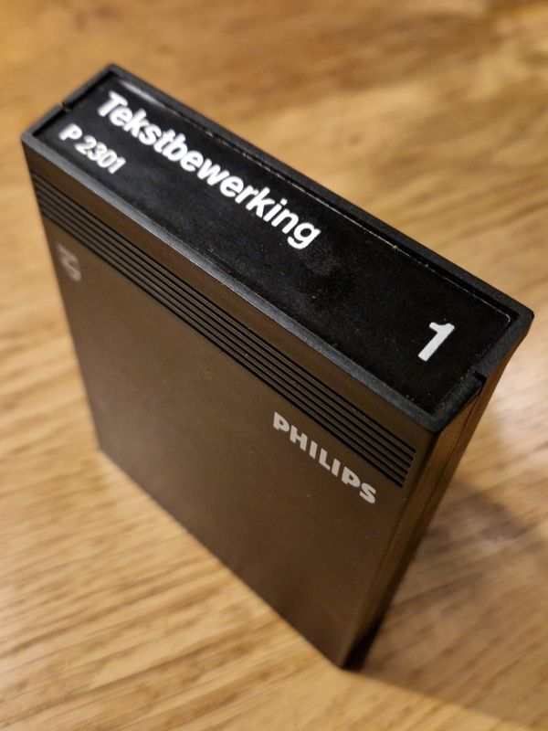
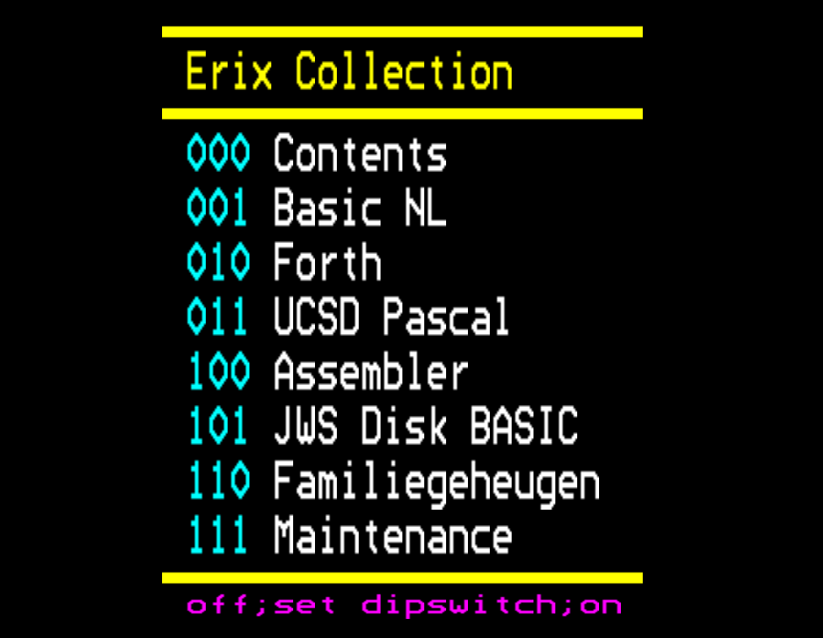
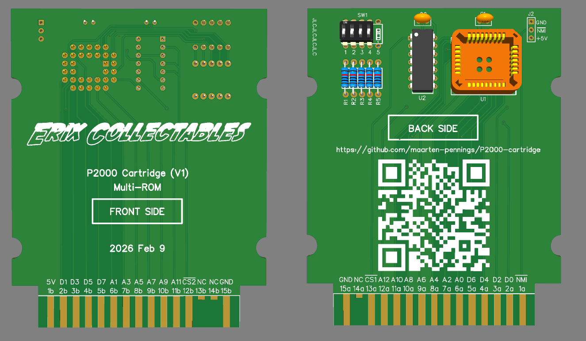
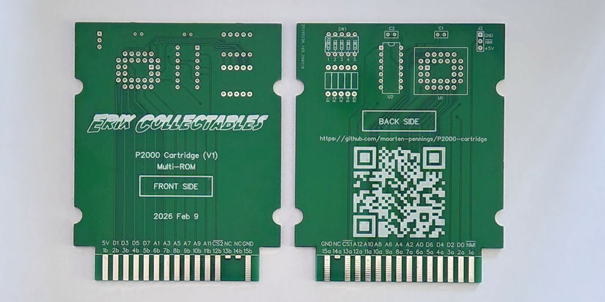
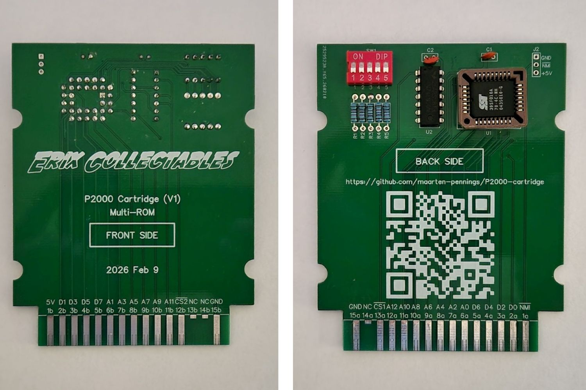

# P2000-cartridge

Making a cartridge for the Philips P2000T.

## Introduction

Since I retrieved an old [Philips P2000](https://github.com/maarten-pennings/P2000) from my attic I wanted to make a cartridge myself. 
I help repairing retro computers at [Erix Collectables](https://www.erixcollectables.nl/), and also there we planned 
making a cartridge to facilitate testing and bringing up P2000 mods.

## Analysis

I did some [analysis](analysis.md) coming to the following conclusions:

- Ivo Filot ([Github](https://github.com/ifilot) or [blog](https://philips-p2000t.nl/)) uses
  the [SST39SF0x0](SST39SF010A-SST39SF020A-SST39SF040-Data-Sheet-DS20005022.pdf), 
  it is one of the cheaper solutions, and we have a programmer for it. 
  We will also pick this memory.
- Let's make a modest multi-rom: SST39SF010 - 1 Mbit or 128 kbyte or 8 ROMs. 
  But let's prepare the PCB that they work for the bigger chips too.
- Use PLCC socket; it is smaller than DIL/DIP.
- No reset switch - we don't need it.

## Which ROMs?

Which ROMs to put on the multi-ROM cartridge?
The chosen flash chip 39SF010 has room for 8.

### Stock cartridges

Likely cartridge images are:

- A self-made table of contents.
- [BASIC NL 1.1](https://github.com/p2000t/software/blob/main/cartridges/BASICNL1.1.bin) because I only have an UK 1.0 cartridge.
- [Forth](https://github.com/p2000t/software/blob/main/cartridges/Forth.bin)
- [UCSD Pascal](https://github.com/p2000t/software/blob/main/cartridges/UCSD%20Pascal.bin)
- [Assembler](https://github.com/p2000t/software/blob/main/cartridges/assembler%205.9.bin)
- [JWS Disk BASIC](https://github.com/p2000t/software/blob/main/cartridges/JWSBasic.bin) because we found a P2000 with built-in JWS drive.
  It seems this was developed by Jan-Willem Sparnaaij to enable floppy disks instead of the cassette recorder in BASIC.
- [Familiegeheugen](https://github.com/p2000t/software/blob/main/cartridges/familiegeheugen%204.bin)
- [Maintenance](https://github.com/p2000t/software/blob/main/cartridges/Maintenance%202.bin), a test cartridge.

List of candidate cartridges can be found on the 
[P2000T Preservation Project](https://github.com/p2000t/software/tree/main/cartridges).

### Own cartridgeL Contents

The proposal is that the first ROM is a sort of table of contents.
I made the [Contents](myroms) ROM myself. 
It is written in assembler, but rather simple: just an LDIR to copy a screen image to the frame buffer.

## Design

I designed a PCB in [EasyEda](https://easyeda.com).

- Schematics [pdf](pcb/P2000Cartridge-schem.pdf) and [json](pcb/P2000Cartridge-schem.json)
- Layout in pdf [front](pcb/P2000Cartridge-pcb-front.pdf) and [back](pcb/P2000Cartridge-pcb-back.pdf)
- The final [gerber](pcb/P2000Cartridge-gerber.zip) for ordering.

I double checked the socket since I don't have it yet.

 

The render of the PCB.

## Cost 

Overview of the [cost](cost.md).

(end)

