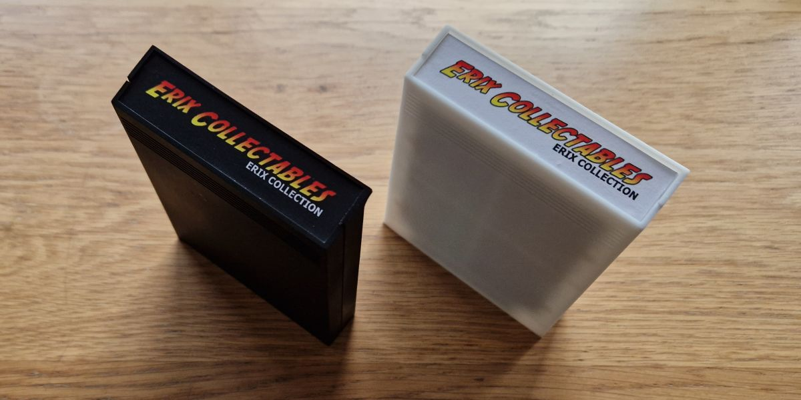
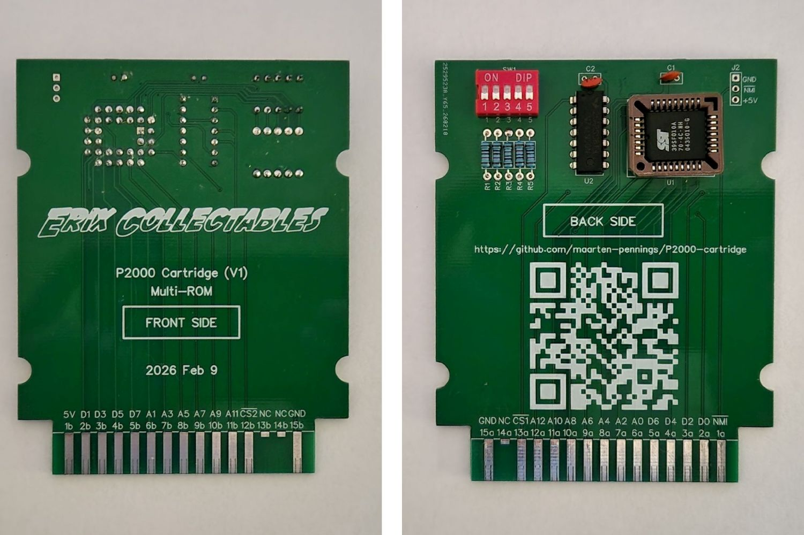
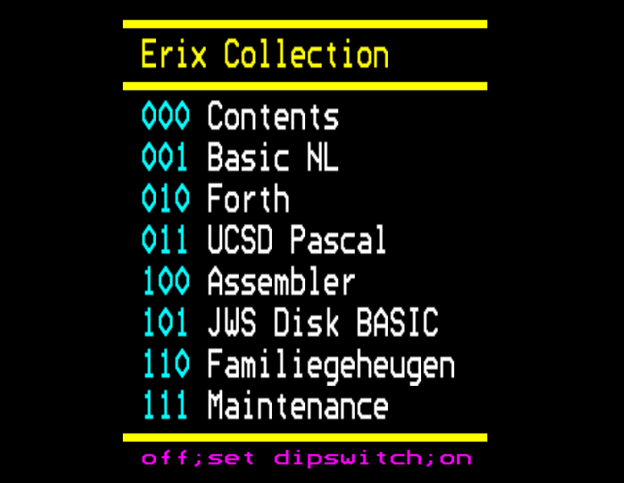
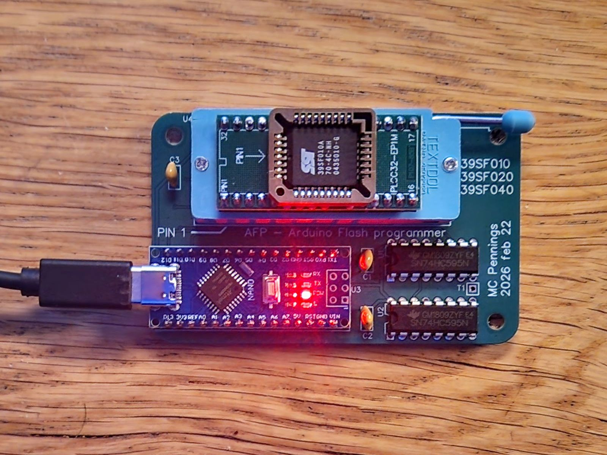
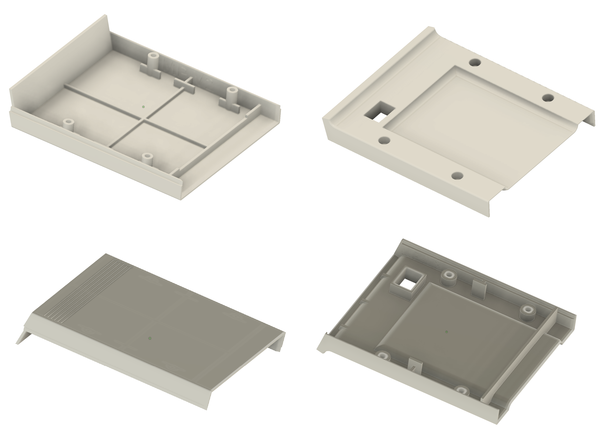
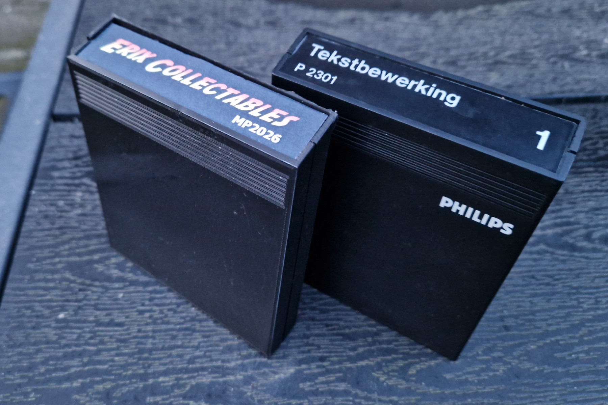
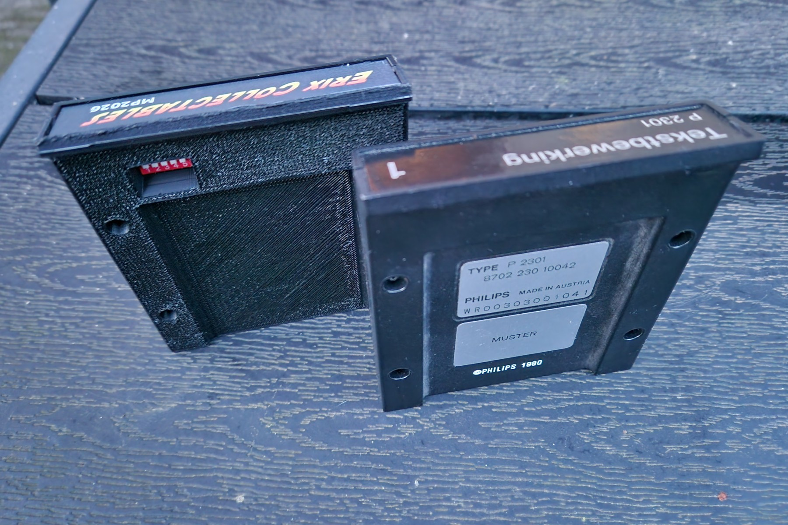
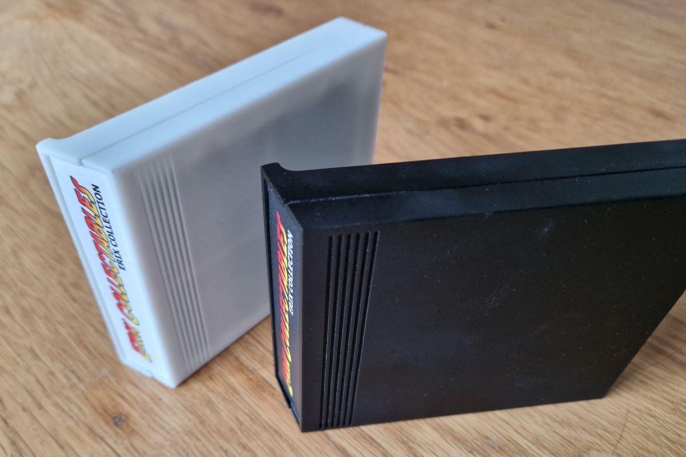
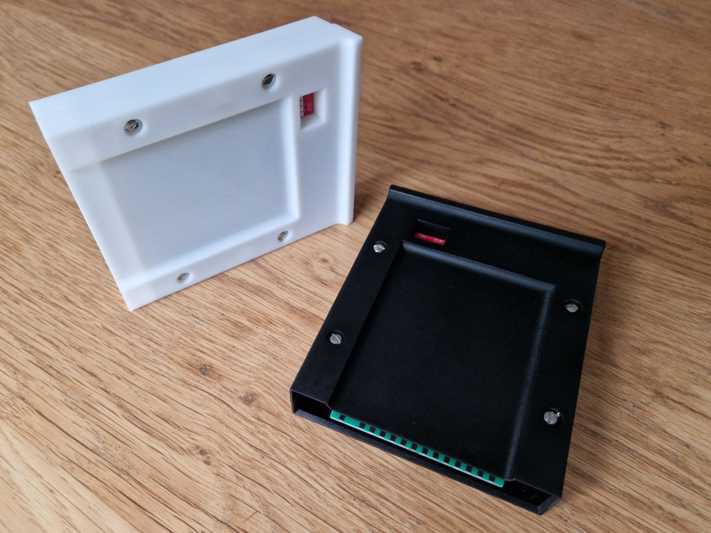
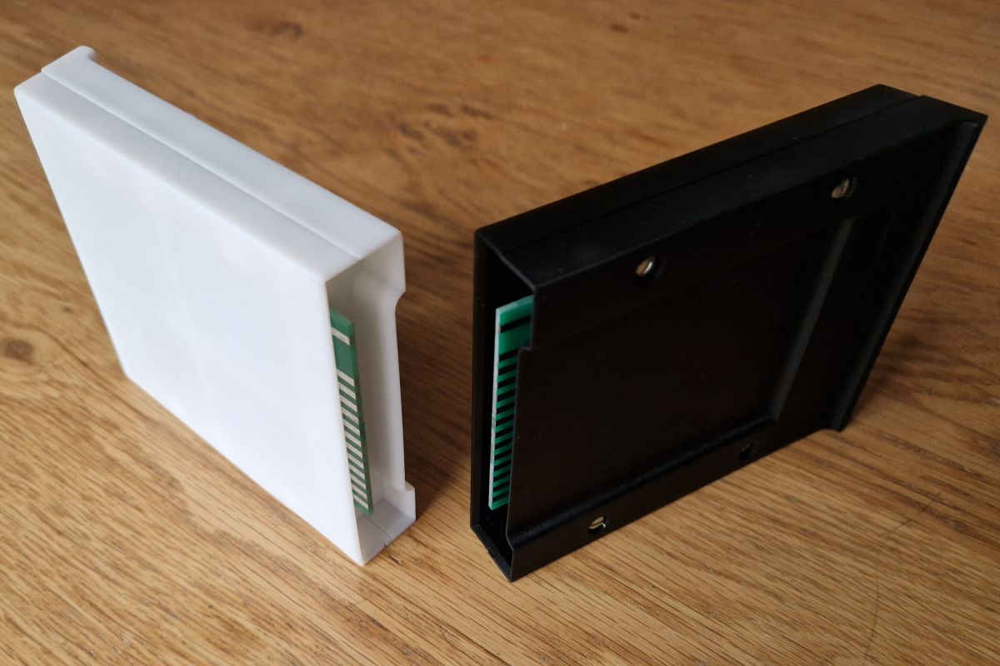

# P2000-cartridge

Making a cartridge for the Philips P2000T.

## Introduction

Since I retrieved an old [Philips P2000](https://github.com/maarten-pennings/P2000) from my attic I wanted to make a cartridge myself. 
I help repairing retro computers at [Erix Collectables](https://www.erixcollectables.nl/), and also there we planned 
making a cartridge to facilitate testing and bringing up P2000 mods.

## Analysis

I did some [analysis](analysis.md) coming to the following conclusions:

- Ivo Filot ([Github](https://github.com/ifilot) or [blog](https://philips-p2000t.nl/)) uses
  the [SST39SF0x0](SST39SF010A-SST39SF020A-SST39SF040-Data-Sheet-DS20005022.pdf), 
  it is one of the cheaper solutions, and we have a programmer for it. 
  We will also pick this memory.
- Let's make a modest multi-rom: SST39SF010 - 1 Mbit or 128 kbyte or 8 ROMs. 
  But let's prepare the PCB that they work for the bigger chips too.
- Use PLCC socket; it is smaller than DIL/DIP.
- No reset switch - we don't need it.

## Design

With the analysis phase done, let's make the [PCB](pcb.md).
Design it, manufacture it, test it (tracks), assemble it, and test functionality.
 

 
Find all design files (schematics, layout, gerber) in the [pcb](pcb) directory.
.

## Selecting ROMs

Which ROMs to put on the multi-ROM cartridge?
The chosen flash chip 39SF010 has room for 8.

### Stock cartridges

Likely cartridge images are:

- (0) A self-made table of [Contents](roms/myroms).  
  You can press any key to get some references.
- (1) [BASIC NL 1.1](https://github.com/p2000t/software/blob/main/cartridges/BASICNL1.1.bin).  
  The [User manual](https://github.com/p2000t/documentation/blob/main/programming/Gebruiksaanwijzing%20P2000T%20met%20P2305%20Basic%20NL.pdf) is available.
- (2) [Forth](https://github.com/p2000t/software/blob/main/cartridges/Forth.bin).  
  The [User manual](https://github.com/p2000t/documentation/blob/main/programming/Forth30.pdf) or maybe
  the [older version](https://github.com/p2000t/documentation/blob/main/programming/Forth12.pdf).
- (3) [UCSD Pascal](https://github.com/p2000t/software/blob/main/cartridges/UCSD%20Pascal.bin).  
  No documentation. Needs floppy?.
- (4) [Assembler](https://github.com/p2000t/software/blob/main/cartridges/assembler%205.9.bin).  
  No documentation.
- (5) [JWS Disk BASIC](https://github.com/p2000t/software/blob/main/cartridges/JWSBasic.bin).  
  For a P2000 with built-in JWS drive.
  It seems this was developed by Jan-Willem Sparnaaij to enable floppy disks instead of the cassette recorder in BASIC.
  Lot of [tape (?) software](https://github.com/p2000t/software/tree/main/cassettes/JWS).
  The [User manual](https://github.com/p2000t/documentation/blob/main/software/JWS.pdf).
- (6) [ECOL](https://github.com/p2000t/software/blob/main/cartridges/ECOL3.0.bin).  
  The Educational COmputer Language, tagged `FTU/OC ECOL 3.0`.
  This seems to be a sort of simplified Dutch Pascal (?). The only two commands that do
  something are `datum` (irrespective of casing) and `edit`. The `:-` key on the numeric board toggles capslock.
  I wonder if it needs to be accompanied by a tape with an editor, because `edit` complains `Verkeerde band`.
- (7) [Maintenance 2](https://github.com/p2000t/software/blob/main/cartridges/Maintenance%202.bin).  
  A test cartridge. See the Cartridge User Manual in the [Field Support Manual](https://github.com/p2000t/documentation/blob/main/hardware/FieldSupportManual-2.pdf) page 7.1 (72).
  Maybe also the [Maintenance manual](https://github.com/p2000t/documentation/blob/main/hardware/Maintenance.pdf).

List of candidate cartridges can be found on the 
[P2000T Preservation Project](https://github.com/p2000t/software/tree/main/cartridges).

The ones listed here are ["backed up"](roms/stockroms) in this repo.

### Own cartridge: Contents

The proposal is that the first ROM is a table of contents.
I made the [Contents](roms/myroms) ROM myself. 
It is written in assembler, but rather simple: just an LDIR to copy a screen image to the frame buffer.
Press any key to get some references (URLs).

### Makefile

The [roms](roms) directory contains a sub directory with the 
[stockroms](roms/stockroms) and a sub directory with [myroms](roms/myroms) 
(the Contents rom). It also contains a [Makefile](roms/Makefile) to compile 
myroms to a `.bin` and convert all `.bin` files (from myroms and from 
stockroms) to flash scripts (`.afp`) - see next section.

## Sub-project: Flash Programmer

We need some tool to flash the `.bin` files to the 39SF0x0 chip.
I don't have one, I could buy one, borrow one or make one.
I went for the latter option an made the "Arduino Flash Programmer".
This topic is described in the [flasher](flasher) directory.

## Casing

One of the last steps is to create a casing.
I wanted it to look as close as possible to the originals.
However, the flash chip in its socket is too high to fit in the original case.
So my case is 1.5mm thicker.
And I have a hole for the dipswitch.

.

I did a 3D print myself. Here mine (left) compared to an original (right).

Find the stl files in the [case](case) sub directory.

I also did a 3D print via JLCPCB in white and black.
Those are more detailed with no "support-artifacts".

## Cost 

Overview of the [cost](cost.md).

(end)

