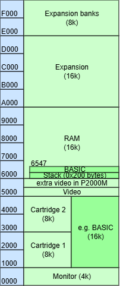
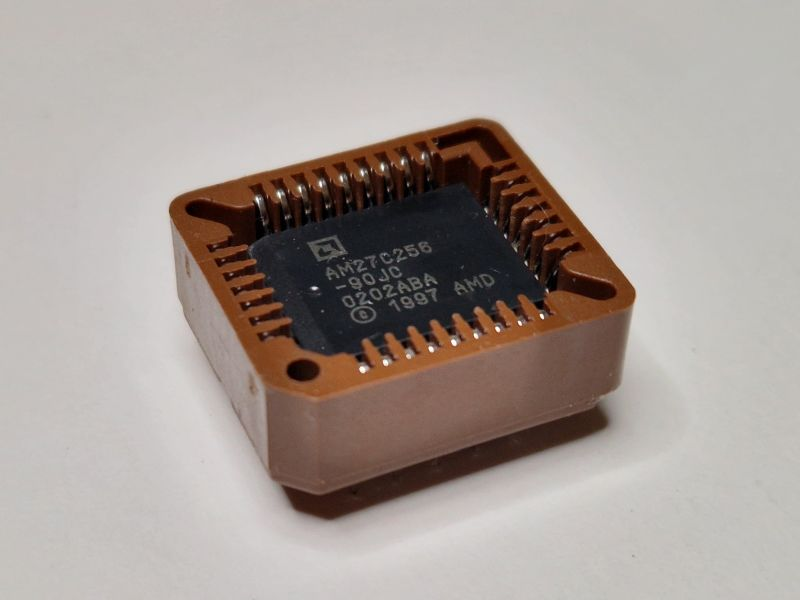
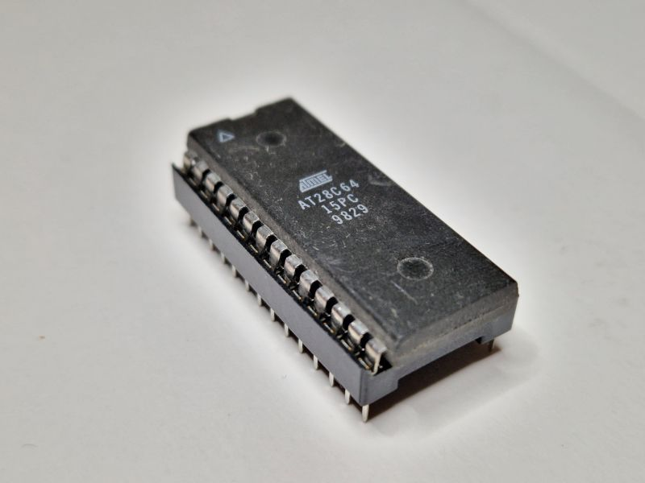
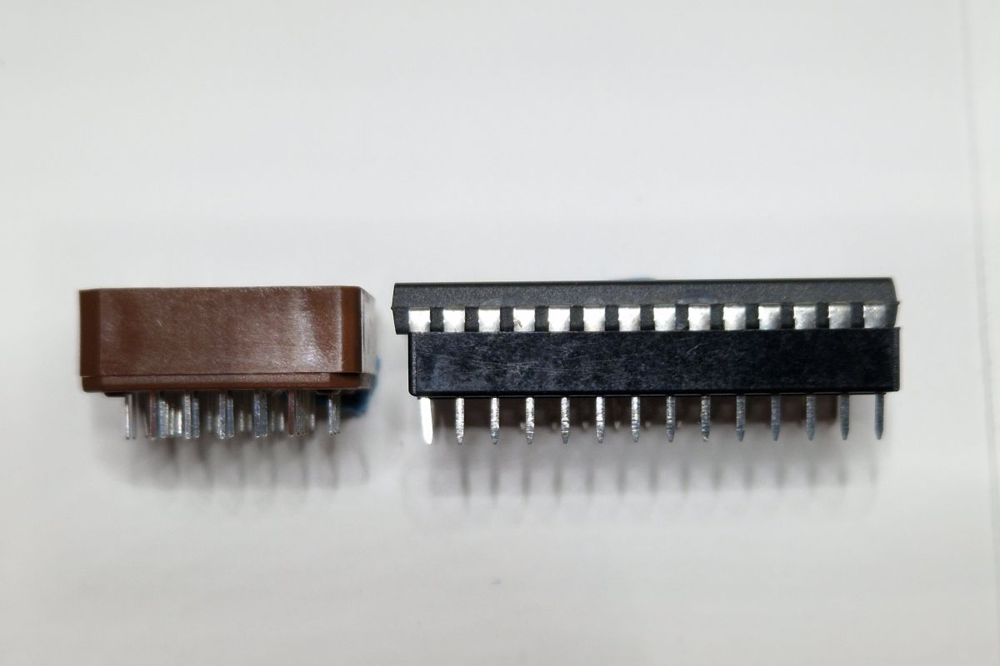
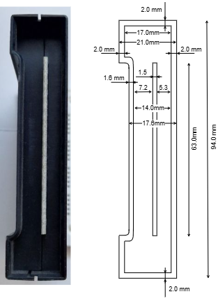
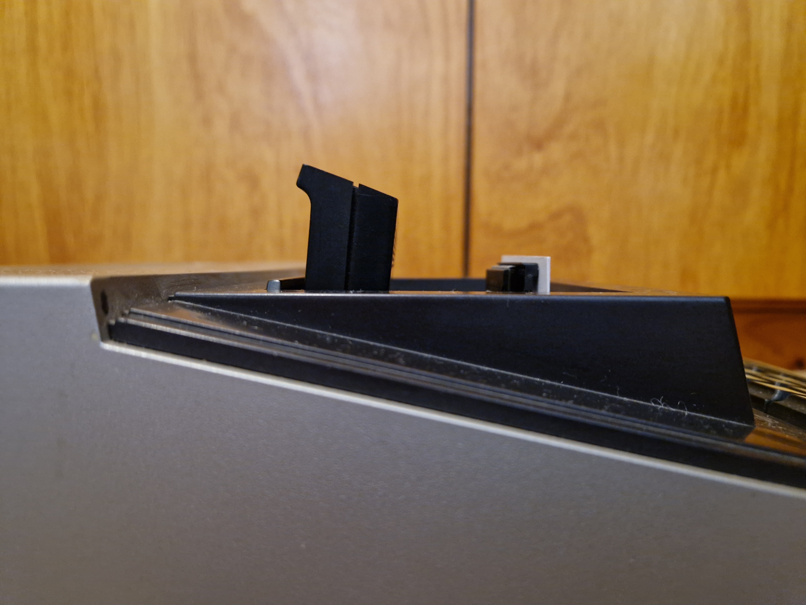
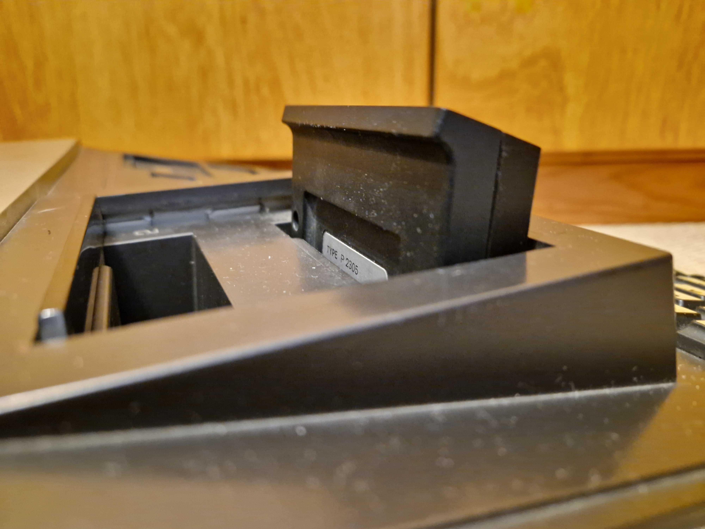
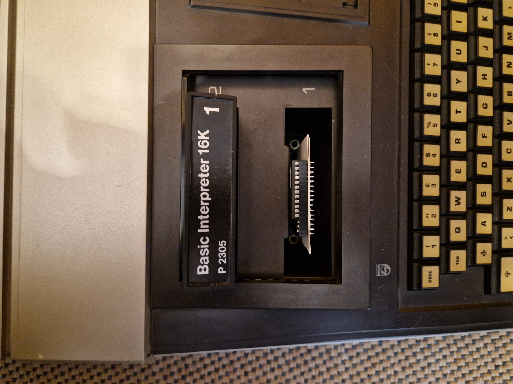
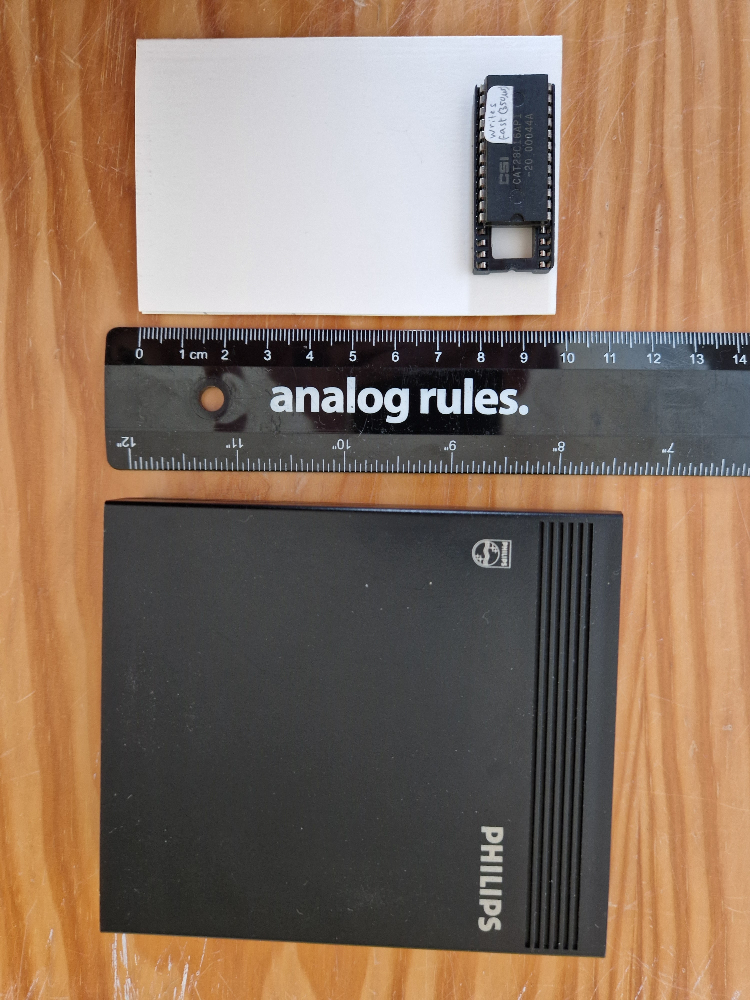
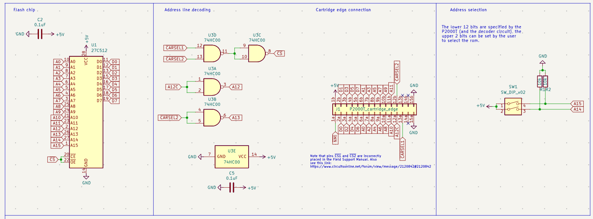

# P2000-cartridge - Analysis

This file documents the analysis I did for [making a cartridge](README.md) for the Philips P2000T.

## Make a single or multi-rom cartridge?

A cartridge either occupies 8 kB or 16 kB in the memory map of the P2000 (see map below).
Modern EEPROMs are typically much bigger, for example an 512 kB EEPROM could store 32 cartridge images of each 16 kB.
The alternative is using a smaller ROM or simply not using the extra memory in the EEPROM.

Technically a multi-rom sounds interesting. Down-sides include: not very retro-like,
not-so robust dip switches needed, need sticker with e.g. 32 entries, don't switch while powered,
do we have enough ROMs to make sense in one EEPROM.

There is a great [GitHiub](https://github.com/ifilot) account from Ivo Filot showing both options.

- ["simple" ie single](https://github.com/ifilot/p2000t-simple-cartridge)

- [Several multi](https://github.com/ifilot/p2000t-cartridges)

## Which EEPROM chip to use?

Again, looking at Ivo's GitHub, there are two likely candidates. 

- The SST39SFxxx series.  

  | Type       |  bit |     byte      | ROMs | dip switches | link    |
  |:-----------|-----:|:-------------:|-----:|:------------:|:--------|
  | SST39SF010 | 1 Mb | ⅛ MB = 128 kB |    8 |      3       |[🔗](https://ww1.microchip.com/downloads/aemDocuments/documents/MPD/ProductDocuments/DataSheets/SST39SF010A-SST39SF020A-SST39SF040-Data-Sheet-DS20005022.pdf) |
  | SST39SF020 | 2 Mb | ¼ MB = 256 kB |   16 |      4       | idem    |
  | SST39SF040 | 4 Mb | ½ MB = 512 kB |   32 |      5       | idem    |
  
  
- The W27Cxxx or W28Cxxx series.

  The W27Cxxx seems to be for EPROMs (one E), they are erased by exposure to a UV (ultraviolet) light. Programming typically requires a higher voltage supply (e.g., 12.5V or 13V Vpp).
  The W28Cxxx seems to be for EEPROMs (two Es), they are electrically erasable and programmable.
  However I have an 27C256 without a "window", so I'm not sure about this.
  
  I have experience with the W28C64, Ivo [mentions](https://github.com/ifilot/p2000t-cartridges?tab=readme-ov-file#4-x-16kib-tht-w27c512-64-kib-rom) the w27c512.

  | Type       |    bit |    byte | ROMs | dip switches | link    |
  |:-----------|-------:|:-------:|-----:|:------------:|:--------|
  | W28C64     |  64 kb |    8 kB |    ½ |    -1   😊   | [🔗](https://ww1.microchip.com/downloads/en/devicedoc/11003L.pdf) |
  | W28C128    | 128 kb |   16 kB |    1 |     0        | [🔗](https://ww1.microchip.com/downloads/aemDocuments/documents/MPD/ProductDocuments/DataSheets/AT28C256-Industrial-Grade-256-Kbit-Paged-Parallel-EEPROM-Data-Sheet-DS20006386.pdf) |
  | W27C256    | 256 kb |   32 kB |    2 |     1        | [🔗](https://ww1.microchip.com/downloads/aemDocuments/documents/OTH/ProductDocuments/DataSheets/11001N.pdf) |
  | W27C512    | 512 kb |   64 kB |    4 |     2        | [🔗](https://ww1.microchip.com/downloads/en/DeviceDoc/doc0015.pdf) |

  
## Which EEPROM package?

Both chips come in two packages.

- PLCC stands for Plastic Leaded Chip Carrier.

  

- DIL or DIP stands for Dual In-line (or Dual In-line Package/Packaging).

  
  
There is a slight height difference of 0.6mm when socketed:
the PLCC is 7.8mm and the DIL is 8.4mmm.

## With or without socket?

With socket allows us to reflash - e.g. when a first flash somehow failed.
Of course we could have one cartridge with socket ("for development") and solder 
all the rest (for "use").

Why is this even a question?
Not the extra money for the socket, but the increased height: 
the P2000 cartridges do not leave room for sockets:
"the PLCC is 7.8mm and the DIL is 8.4mmm", both more than 7.2.

We could put the socketed chip in the top of the cartridge.
See here some photos of a mockup.

## How to program the EEPROM?

I do have a self-made [programmer](https://github.com/maarten-pennings/6502/tree/master/3eeprom#3a2-the-programmer).
Unfortunately, it only supports 28C16 and 28C64; we would now need at least one notch up: 28C128.

I do not yet have an overview of good programmers, there might be one available with a colleague.

It turns out, colleagues at Erix Collectibles do have a programmer.

## Reset switch?

Do we want a reset switch? Quite complicated schematics.

## Schematics

When we look at Ivo's [27C512](https://github.com/ifilot/p2000t-cartridges?tab=readme-ov-file#4-x-16kib-tht-w27c512-64-kib-rom) solution
it is very similar to the SST39SF040  solution.

Source: [click sch file in right pane](https://kicanvas.org/?repo=https%3A%2F%2Fgithub.com%2Fifilot%2Fp2000t-cartridges%2Ftree%2Fmaster%2Fmulticartridge-w27c512%2Fpcb)

Contents of this design:

- Flash chip with a capacitor.
- Cartridge edge connector.
- Dip switch controlling A14 and A15.
- Address decoding with one quad NAND (with cap).

Explanation of the design:

- Flash chip routes D0..D7 to edge connector.
- Flash chip routes A0..A11 to edge connector.
- Flash chip routes A12 and A13 to address decoding.
- Flash chip routes A14 and A15 to dip switches.

The hardest part is the address decoding.
But I happen to have investigated that [earlier](https://github.com/maarten-pennings/P2000/blob/main/readme.md#addressing).

## Proposal

- Let's go for a modest multi-rom.
- We have a programmer for SST39SF010, Ivo uses it and it is cheaper.
- PLCC is smaller.
- I want to go for with-socket; maybe move the socket to the top of the PCB.
- No reset switch - don't need it.

(end)

