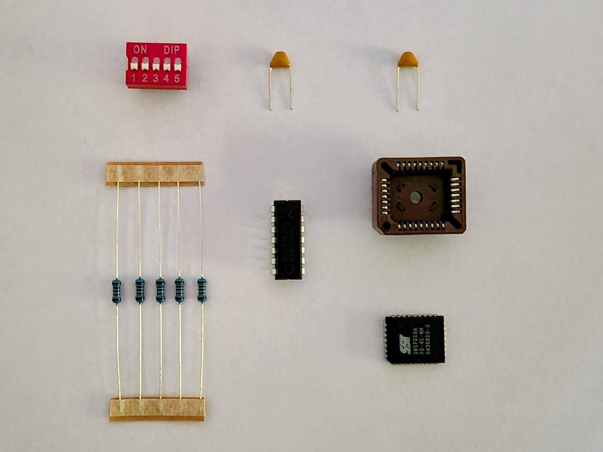
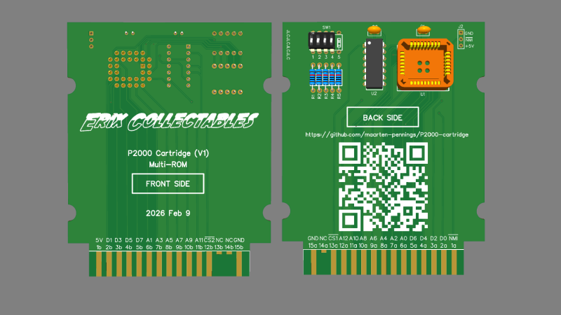

# P2000-cartridge - Cost

This file documents the cost made for a Philips P2000T cartridge.

## Components

All components were ordered from AliExpress.

We ordered components for 10 cartridges.

  | Description       | Quantity  |     Cost | Link                                                        |
  |:------------------|----------:|---------:|:-----------------------------------------------------------:|
  | Resistor 10kΩ     | 70+  3×10 |    €1.19 | [🔗](https://nl.aliexpress.com/item/32952657927.html)       |
  | PLCC32-DIP socket |        10 |    €3.12 | [🔗](https://nl.aliexpress.com/item/33056827347.html)       |
  | DIPswitch 3 wide  |        10 |    €2.14 | [🔗](https://nl.aliexpress.com/item/4001205849246.html)     |
  | PLCC32 to DIP32   |         1 |    €1.62 | [🔗](https://nl.aliexpress.com/item/1005006221329883.html)  |
  | SST39SF010A (mem) |        10 |    €6.39 | [🔗](https://nl.aliexpress.com/item/1005008535405486.html)  |
  | SN74LS00N (4×NAND)|        10 |    €2.43 | [🔗](https://nl.aliexpress.com/item/1005002328900896.html)  |
  | Shipping          |         1 |    €0.00 |                                                             |
  | **Total**         |           |**€16.89**| [🔗](images/invoice-aliexpress.png)                         |
 

## PCB

We ordered 10 PCBs.

  | Description        | Quantity |     Cost | Link                            |
  |:-------------------|---------:|---------:|:--------------------------------|
  | PCBs               |       10 |   €4.22  |                                 |
  | Shipping           |        1 |   €9.23  |                                 |
  | Import Taxes (21%) |        1 |   €2.83  |                                 |
  | Payment fee        |        1 |   €0.42  |                                 |
  | **Total**          |          |**€16.70**| [🔗](images/invoice-jlcpcb.png) |

## Casing 

tbd

(end)

