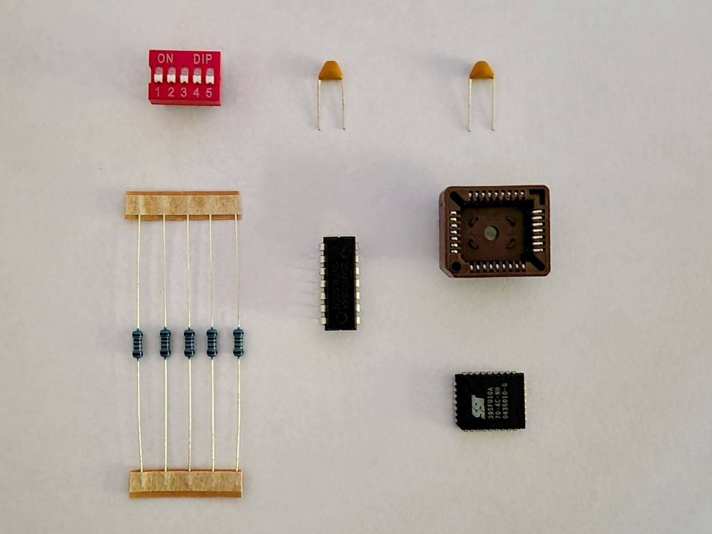
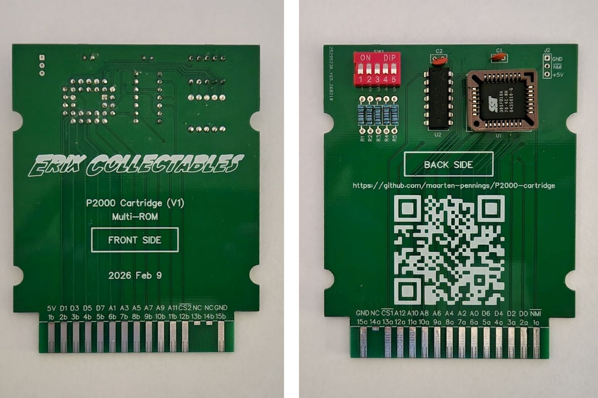
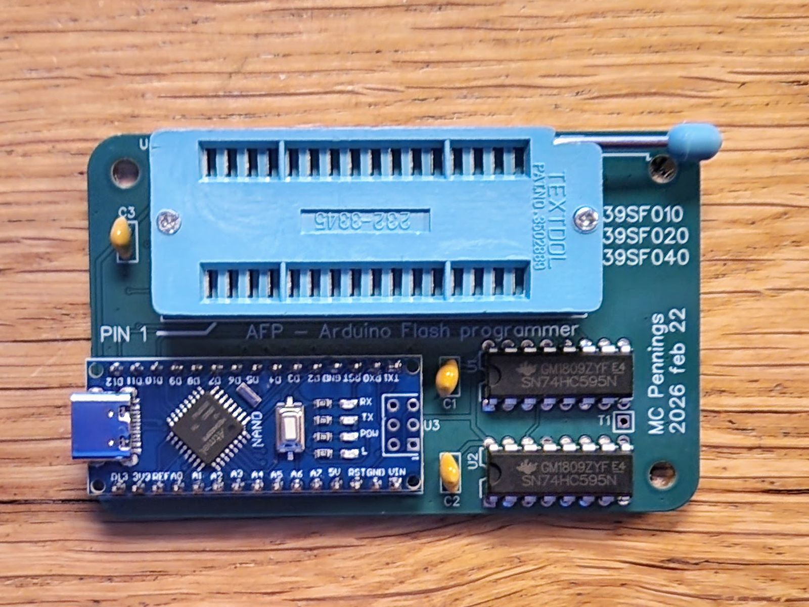

# P2000-cartridge - Cost

This file documents the cost made for a Philips P2000T cartridge.

## Cartridge 

Needed to purchase components and the PCB.

### Cartridge components

All components were ordered from AliExpress.
One cartridge needs these.

Observe that I ordered SST39SF010A memories. These are 1Mbit or 128kB which holds 8 ROMs (of 16kB).
The PCB can also handle SST39SF020A and SST39SF020A memories (for 16 or even 32) ROMs.
These PCBs will have SST39SF010A, so I first bought 3-throw dip switches, but
later decided to mount 5-throw switches. I also found out I ran out of capacitors, so 
I later bought a bag 100nF.

I ordered components for 10 cartridges.

  | Description       | Quantity  |     Cost | Link                                                        |
  |:------------------|----------:|---------:|:-----------------------------------------------------------:|
  | Resistor 10kΩ     | 50+  5×10 |    €1.19 | [🔗](https://nl.aliexpress.com/item/32952657927.html)       |
  | Capacitor 100nF   | 80+  2×10 |    €1.79 | [🔗](https://nl.aliexpress.com/item/1005010370389462.html)  |
  | PLCC32-DIP socket |        10 |    €3.12 | [🔗](https://nl.aliexpress.com/item/33056827347.html)       |
  | DIPswitch 5 wide  |        10 |    €2.16 | [🔗](https://nl.aliexpress.com/item/4001127324718.html)     |
  | PLCC32 to DIP32   |         1 |    €1.62 | [🔗](https://nl.aliexpress.com/item/1005006221329883.html)  |
  | SST39SF010A (mem) |        10 |    €6.39 | [🔗](https://nl.aliexpress.com/item/1005008535405486.html)  |
  | SN74LS00N (4×NAND)|        10 |    €2.43 | [🔗](https://nl.aliexpress.com/item/1005002328900896.html)  |
  | Shipping          |         1 |    €0.00 |                                                             |
  | **Total**         |           |**€18.70**| [🔗](images/invoice-aliexpress.png)                         |
 

### Cartridge PCB

I ordered 10 [PCBs](pcb).

  | Description        | Quantity |     Cost | Link                            |
  |:-------------------|---------:|---------:|:--------------------------------|
  | PCBs               |       10 |   €4.22  |                                 |
  | Shipping           |        1 |   €9.23  |                                 |
  | Import Taxes (21%) |        1 |   €2.83  |                                 |
  | Payment fee        |        1 |   €0.42  |                                 |
  | **Total**          |          |**€16.70**| [🔗](images/invoice-jlcpcb.png) |

## Android Flash Programmer

Needed to purchase components and the PCB.

### AFP components

I later made the Android Flash Programmer PCB, so that I could program the SST39SF010A memories.
I decided to make 2.

  | Description       | Quantity  |     Cost | Link                                                        |
  |:------------------|----------:|---------:|:-----------------------------------------------------------:|
  | Capacitor 100nF   | re-used   |    €0.00 | [🔗](https://nl.aliexpress.com/item/1005010370389462.html)  |
  | ZIF socket        |         2 |    €2.20 | [🔗](https://nl.aliexpress.com/item/1005006117085994.html)  |
  | Arduino Nano      | 1+      2 |    €6.08 | [🔗](https://nl.aliexpress.com/item/1005007392605300.html)  |
  | PLCC extractor    |         1 |    €1.89 | [🔗](https://nl.aliexpress.com/item/1005007532973884.html)  |
  | SN74HC595         | stock 2×2 |    €0.00 |                                                             |
  | Shipping          |         1 |    €0.00 |                                                             |
  | **Total**         |           |**€10.17**|                                                             |

### AFP PCB

I ordered 5 PCBs (minimum order quantity) with slow shipping.

  | Description        | Quantity |     Cost | Link                            |
  |:-------------------|---------:|---------:|:--------------------------------|
  | PCBs               |        5 |   €1.69  |                                 |
  | Shipping           |        1 |   €1.27  |                                 |
  | Import Taxes (21%) |        1 |   €0.63  |                                 |
  | **Total**          |          | **€3.59**| [🔗](flasher/pcb/order.png")    |

## Casing 

tbd

## Total 

  | Description          | Quantity |       Cost |
  |:---------------------|---------:|-----------:|
  | Cartridge components |       10 |    €18.70  |
  | Cartridge PCBs       |       10 |    €16.70  |
  | AFP components       |        2 |    €10.17  |
  | AFP PCBs             |        2 |     €3.59  |
  | **Total**            |          |  **€49.16**|

(end)

