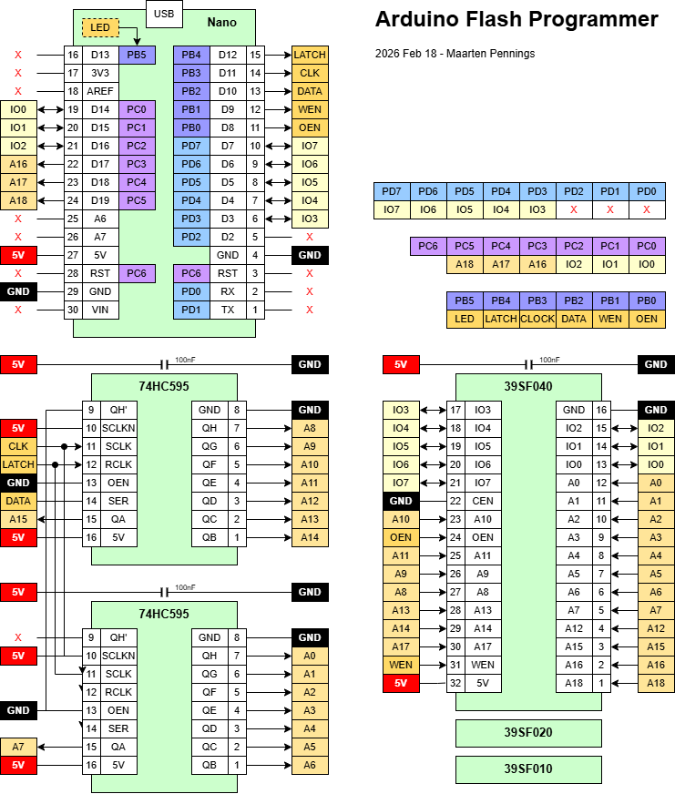
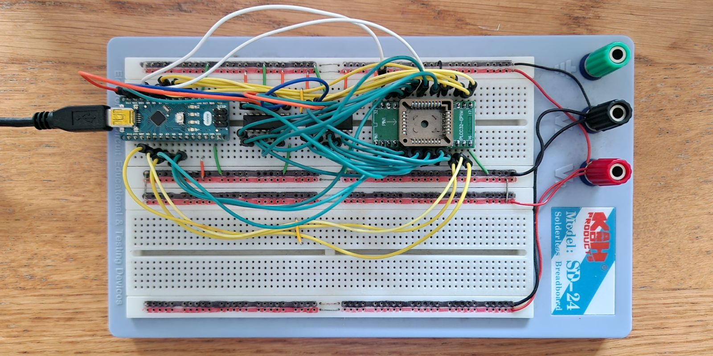
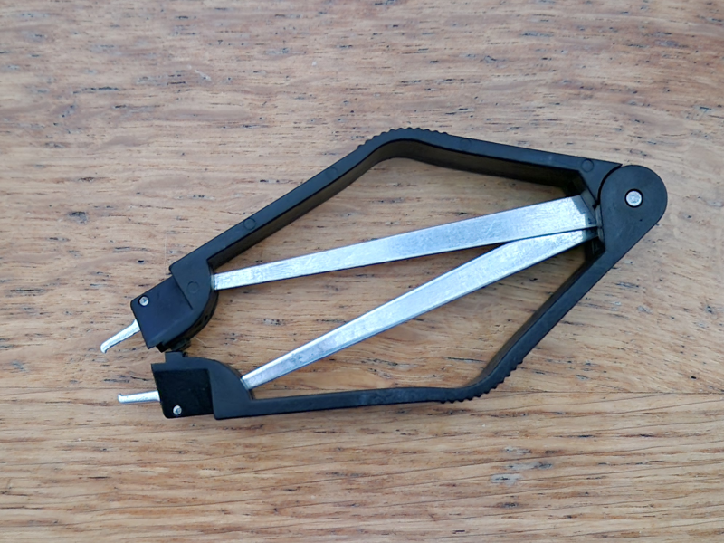
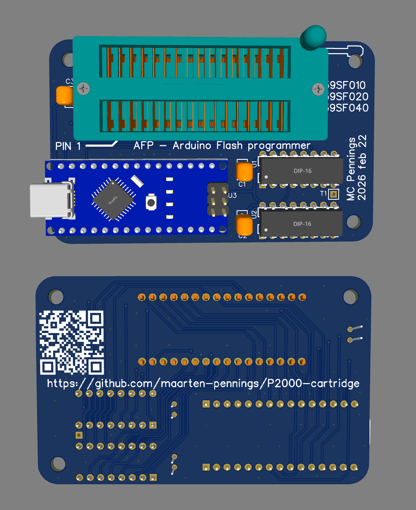
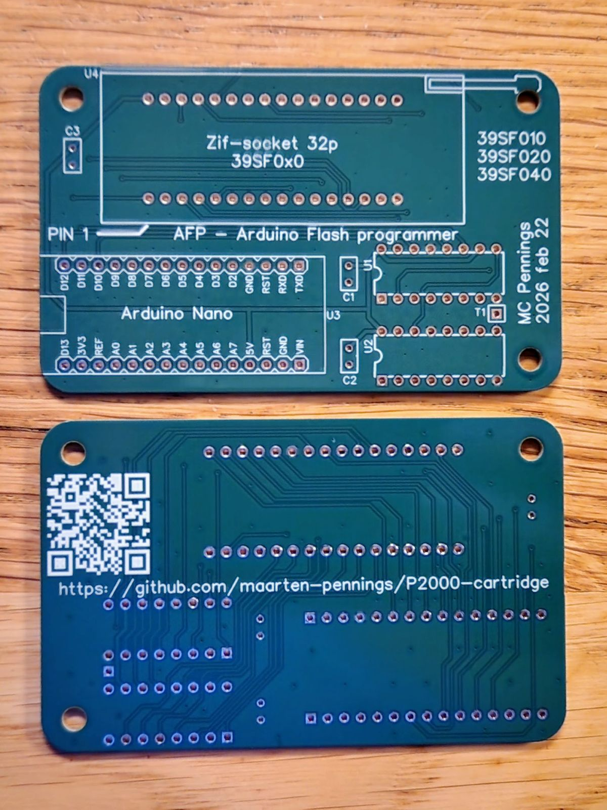
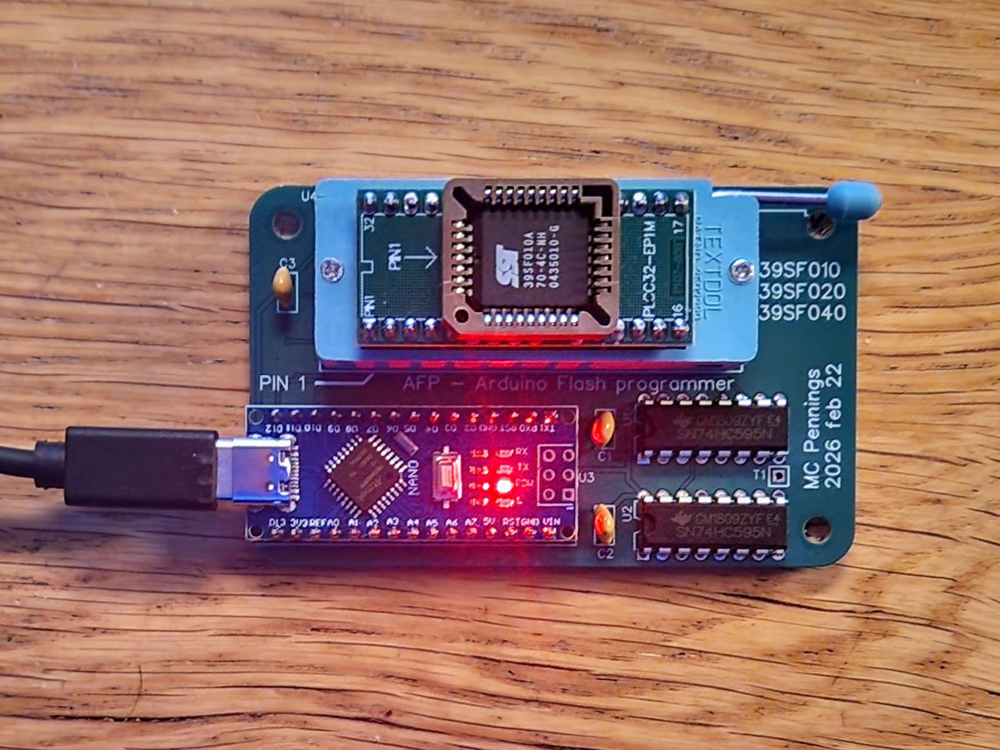

# AFP - Arduino Flash Programmer

Making a tool to program ("burn") a flash memory.
We use an Arduino Nano with two shift registers.

## Prototype

The concept is inspired by [slu4coder's GitHub](https://github.com/slu4coder/SST39SF010-FLASH-Programmer).

I testing this on a breadboard

It appears we need a tool to get the flash chip out of its socket.

## AFP PCB 

All files are stored in the [pcb](pcb) directory.

### Schematics

I designed the PCB schematics in [EasyEda](https://easyeda.com).
They are available in [pdf](pcb/AFP-schem.pdf) and 
as EasyEda [json](pcb/AFP-schem.json) source.

### Layout

Also the PCB layout I did in [EasyEda](https://easyeda.com).
The layout is available as two pdfs [front](pcb/AFP-pcb-front.pdf) and [back](pcb/AFP-pcb-back.pdf),
and also as EasyEda [json](pcb/AFP-pcb.json) source.

### Gerber

For ordering at [jlcpcb](https://jlcpcb.com) I created a gerber file.
The final [gerber](pcb/AFP-gerber.zip) is also available in this repo.

The render of the PCB.

### PCBs

I ordered at 2026-02-22 and 2026-03-04 the PCBs arrived at my home.

After mounting the two ICs, 3 caps, the Arduino Nano and ZIF socket,
the PCB was ready.

## AFP firmware

The [AFP firmware](afp) shall be compiled with the 
[Arduino IDE](https://www.arduino.cc/en/software)
and flashed to the Nano.

I use an adapter board to convert DIL to PLCC.

(end)

