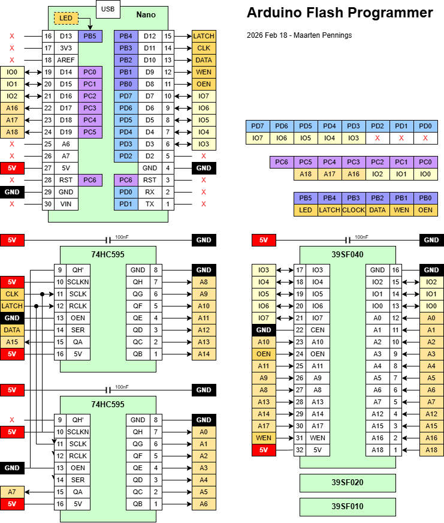
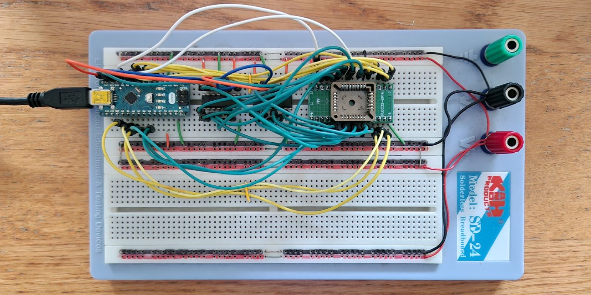
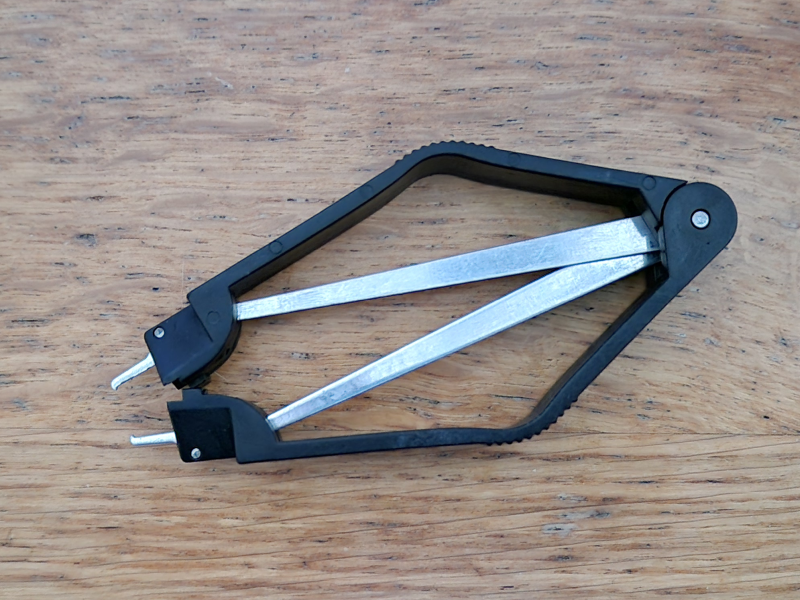
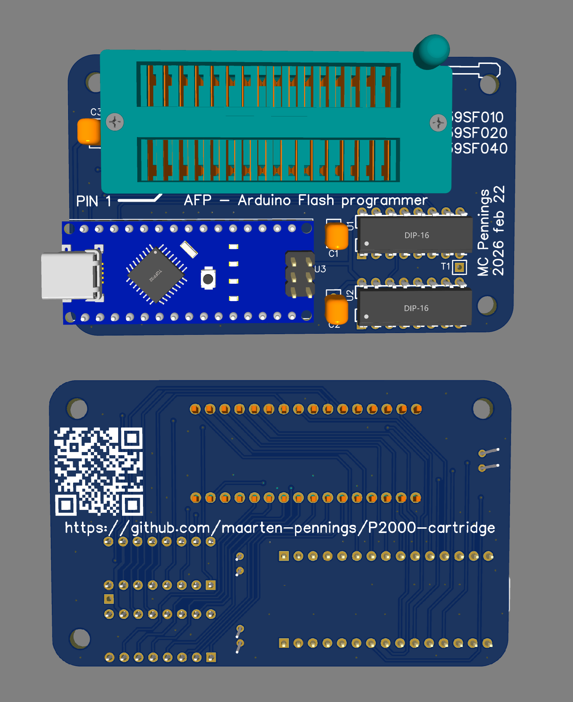
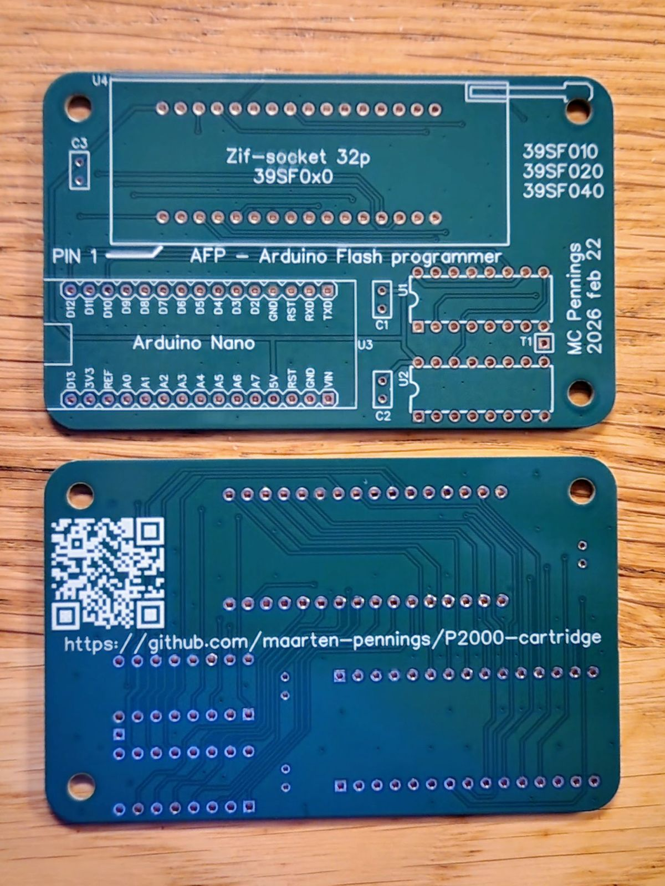
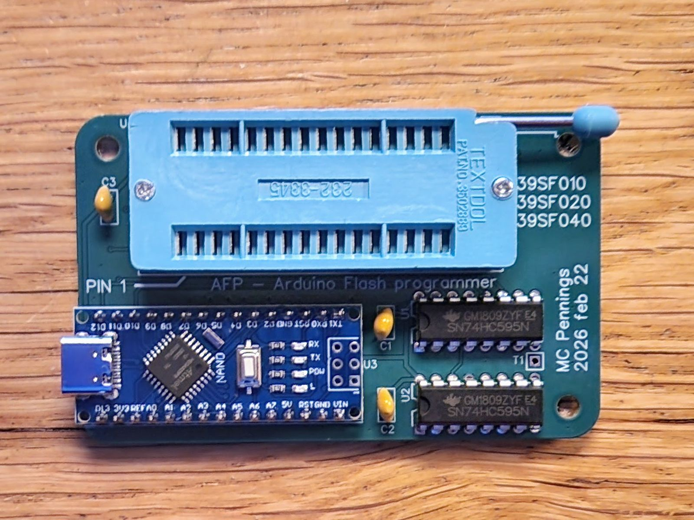
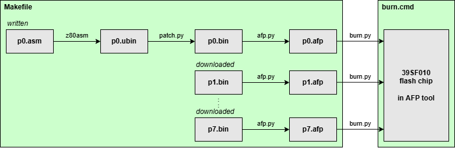
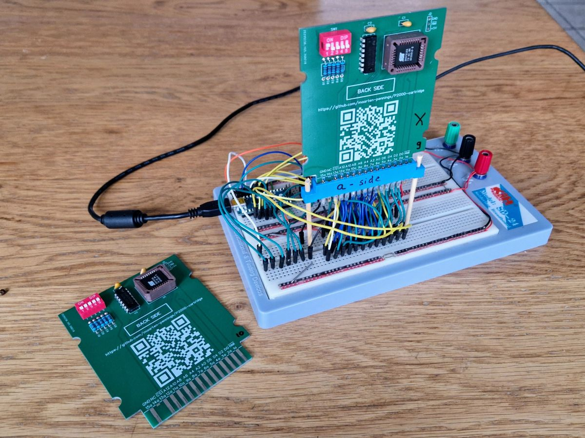

# AFP - Arduino Flash Programmer

Making a tool to program ("burn") a flash memory.
We use an Arduino Nano with two shift registers to make
the _Arduino Flash Programmer_.


## Prototype

The concept is inspired by [slu4coder's project on GitHub](https://github.com/slu4coder/SST39SF010-FLASH-Programmer).
This is my version of the schematics.



I tested this on a breadboard



I quickly found out that I need a tool to get the flash chip 
out of its socket.




## AFP PCB 

All design files for the PCB are stored in the [pcb](pcb) directory.


### Schematics

I designed the PCB schematics in [EasyEda](https://easyeda.com).
The schematics are available in [pdf](pcb/AFP-schem.pdf) and 
as EasyEda [json](pcb/AFP-schem.json) source.


### Layout

Also the PCB layout I did in [EasyEda](https://easyeda.com).
The layout is available as two pdfs [front](pcb/AFP-pcb-front.pdf) and [back](pcb/AFP-pcb-back.pdf),
and also as EasyEda [json](pcb/AFP-pcb.json) source.


### Gerber

For ordering at [jlcpcb](https://jlcpcb.com) I created a gerber file.
The final [gerber](pcb/AFP-gerber.zip) is also available in this repo.

### PCB render 

The render of the PCB.




### PCBs

I ordered at 2026-02-22 and 2026-03-04 the PCBs arrived at my home.




### Assembly 

After mounting the two ICs, 3 caps, the Arduino Nano and ZIF socket,
the PCB was ready.




### Final product

I use an adapter board to convert DIL to PLCC.


## AFP firmware

The [AFP firmware](afp) shall be compiled with the 
[Arduino IDE](https://www.arduino.cc/en/software)
and flashed to the Nano.


## AFP Manual

Once the firmware is flashed, the AFP connected to a PC, 
a terminal program needs to be started. Make sure to select 
the correct COM port (see e.g. Device Manager), and configure
the terminal program for 15200,8N1. You could use the 
terminal program built into Arduin0.

You should be welcomed with the following banner.

```
      _       ________  _______
     / \     |_   __  ||_   __ \
    / _ \      | |_ \_|  | |__) |
   / ___ \     |  _|     |  ___/
 _/ /   \ \_  _| |_     _| |_
|____| |____||_____|   |_____|
Arduino Flash Programmer - version 1.0a

drv  : init
cmd  : init
cmds : init

Type 'help' for help
>> 
```

The `>>` is the prompt of AFP. 


### help

As suggested, we can type `help` to get a list of commands.

```
>> help
Available commands
echo - echo a message (or en/disables echoing)
erase - erase (sector of) the flash
flash - view and control flash size
help - gives help (try 'help help')
info - application and cpu info
read - read flash contents
write - write bytes to flash
```

Help on help explains that commands and sub commands may be shortened.

```
>> help help
SYNTAX: help
- lists all commands
SYNTAX: help <cmd>
- gives detailed help on command <cmd>
NOTES:
- all commands may be shortened, for example 'help', 'hel', 'he', 'h'
- all sub commands may be shortened, for example 'help help' to 'help h'
- normal prompt is >>, other prompt indicates streaming mode
- commands may be suffixed with a comment starting with //
- some commands support a @ as prefix; it suppresses output of that command
```

### echo and info

The `echo` command prints user supplied messages back. 
Give `help echo` if you want to know details.
We skip it here.

Another command we do not further discuss is `info`.

```
>> info
name   : Arduino Flash Programmer
version: 1.0b
author : Maarten Pennings
date   : 2026 mar 20
voltage: 4634 mV
cpufreq: 16000000 Hz
uartbuf: 64 bytes
```


### erase 

A more interesting command is `erase`.
Note that for safety reasons this can not be shortened.

```
>> help erase
SYNTAX: erase
- shows which sectors are empty or in use
SYNTAX: erase <addr>
- erases (ie fill with 0xFF) the sector indicated by <addr>
- when <addr> has form 'all', the whole chip (all sectors) is erased
- when <addr> has form 's<hex>' (sector) that sector is erased
- when <addr> has form 'r<hex>' (rom) all sectors of that rom are erased
NOTE:
- <hex> is in hex
- a sector (4096 bytes) is the unit of erase of the flash chip
- a rom consists of <rom> sectors, the unit of use (eg ROM cartridge)
- <rom> is set with the 'flash' command
- for added safety 'erase' command can not be abbreviated
```

It allows us to pass what to erase: typically a sector (4 kbyte),
or a "rom" (a group of 4 sectors), or "all" sectors. 

Note that "erase" in flash memory terms writes 0xFF to all 
bytes in a sector. That is typical for flash memories: erase 
is per sector. Once a sector is erased to 0xFF, writes to bytes 
are allowed; they can only change 1's to 0's.

A nice feature of `erase` is to run it without arguments, it
then lists which sectors are "empty", that is, (still) 
completely filled with 0xFF.

If we run this on a memory already programmed with "our" 
stock image, we get this overview.

```
>> erase
rom sectors addresses    state-of-sectors:empty/inuse
R00 S00-S03 00000-03fff:  inuse    -      -      -  
R01 S04-S07 04000-07fff:  inuse  inuse  inuse  inuse
R02 S08-S0b 08000-0bfff:  inuse  inuse  inuse    -  
R03 S0c-S0f 0c000-0ffff:  inuse  inuse  inuse  inuse
R04 S10-S13 10000-13fff:  inuse  inuse  inuse  inuse
R05 S14-S17 14000-17fff:  inuse  inuse  inuse  inuse
R06 S18-S1b 18000-1bfff:  inuse  inuse  inuse  inuse
R07 S1c-S1f 1c000-1ffff:  inuse  inuse  inuse  inuse
clusters: empty 4 inuse 28
```

This tells us that rom 0 (sectors 0-3) contains a small program
(max 4k): the upper 3 sectors are still empty.

It also tells us that the third rom (sectors 8,9,10 and 11) 
only uses 3 sectors, not 4.


### flash

AFP, firmware and PCB support three memory chips: 
39SF010 (128k), 39SF020 (256k) and 39SF040 (512k).
They have the same footprint, the smaller chips just 
ignore 2 or 1 address line.

With the flash command, we tell AFP what we use.
There is an auto detect.

```
>> flash chip auto
manid BF: Microchip/SST
devid B5: 39SF010 (1 Mbit = 128 kbyte)
chip size: 128 kbyte (32 sectors) (8 roms)
``` 

This command also allows setting the "rom" size.
This is a software feature. 
All addresses entered are either a hex number (actual address), 
or an `S` followed by a hex number (the hex number is the sector number, 
the actual address is found by multiplying by 4k), or an 
`R` followed by a hex number (the hex number is the rom number).
How many sectors a rom is can be set with `flash 

```
>> flash rom 16
rom  size: 16 kbyte (4 sectors)
```

Here we set it to 16 kbytes, the size of P2000 ROMS.
This happens to be the default of AFP anyhow.


### read

The read command needs a starting address and a size.
As starting address we can pass an address, sector number,
or rom number.

These reads target the same address with these three options.

```
>> read r3 20
R03 S0c 0c000: 5c 00 00 00 00 00 00 00  00 00 00 00 00 00 00 e9
R03 S0c 0c010: 18 4d 0c 00 5e 14 0d 81  00 00 00 00 00 00 00 00
>> read s0c 20
R03 S0c 0c000: 5c 00 00 00 00 00 00 00  00 00 00 00 00 00 00 e9
R03 S0c 0c010: 18 4d 0c 00 5e 14 0d 81  00 00 00 00 00 00 00 00
>> read c000 20
R03 S0c 0c000: 5c 00 00 00 00 00 00 00  00 00 00 00 00 00 00 e9
R03 S0c 0c010: 18 4d 0c 00 5e 14 0d 81  00 00 00 00 00 00 00 00
```

When not specifying the size, a whole "page" is printed (256 bytes).
When not specifying an address the read continues 
where the previous read stopped.


### write

After `erase` the most important command is `write`.
We pass it an address (again three flavors are supported:
address, sector, rom) and the data bytes. This command 
supports streaming mode: by passing `*` as data byte streaming 
mode is toggled. When streaming mode is enabled, an end of line 
(new line) doe snot terminate the write command. It just continues 
on the next line, the prompt will show the address.

As an example see streaming mode in action.

```
>> read s3 20
R00 S03 03000: ff ff ff ff ff ff ff ff  ff ff ff ff ff ff ff ff
R00 S03 03010: ff ff ff ff ff ff ff ff  ff ff ff ff ff ff ff ff
>> write s3 11 22 33 * 44
w03004>> 55 66 
w03006>> 77 * 88
>> read s3 20
R00 S03 03000: 11 22 33 44 55 66 77 88  ff ff ff ff ff ff ff ff
R00 S03 03010: ff ff ff ff ff ff ff ff  ff ff ff ff ff ff ff ff
```

It might be good to know that the write command maintains 
error statistics. These can be reset.

```
>> write stats clear
cleared
>> write s3 aa bb
>> write stats
bytes written 2
write errors  2
elapsed time  25342 ms
```

Both write failed because sector s3 was just written with 
`11 22`, so a write of `aa bb` without an erase fails.


## Script

In the sub-directory [roms](../roms) you find all the roms 
(binary files), and (Python) programs that result in a script
(sequence of write commands) for the AFP tool.

There are several tools in the flow:




## Test rig

One out of the 10 cartridges I made is not working.
It is cartridge nr 9; when I plug it into a P2000 it is not recognized (as in the checksum fails).
I swapped the 39SF010 ROM with another cartridge, but nr 9 keeps failing.

I bought an edge connector, hooked it up to an Arduino.
Basically I made a test rig, similar to the AFP board design.
I read the ROM, but this proved ok.
I'm puzzled why it is not working.



(end)

