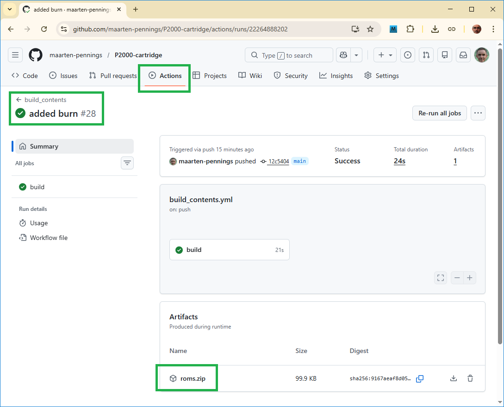

# P2000-cartridge - Contents ROM

Partly as a proof of concept, partly for branding and partly for documentation,
I decided to make my own _Contents_ ROM. 

## Introduction

The idea is that the _Contents_ app can operate as a real cartridge.
A ROM chip filled with the app's image should make the P2000 boot loader accept it.
This means the image should start with the correct header, and have a matching checksum.
Then the boot loader will start our app.

The _Contents_ ROM would be the first ROM in our multi ROM cartridge.
We keep this app simple. It should simply list which other ROMs are stored on the multi ROM.
It is written in assembler, but rather simple: just an LDIR to copy a screen 
image in the ROM to the frame buffer.

It should be noted that the P2000 has a frame buffer that holds 80×25 characters.
This is twice as wide as the screen, which is 40×25 characters.
With an `OUT` instruction we can determine which column starts on the physical display.
It should also be noted that the P2000 only has a "character buffer", not a "color buffer".
Different colors are created by "switch color" characters that display as a space on the screen.
It does mean that just copying the 2000 bytes is enough.

## Implementation

For the source file, see the [src directory](contents.asm).

Notes

- A cartridge maps at 0x1000, so the first line is `org 0x1000`.

- Next comes the 16 byte header. 
  See [P2000 System T&M Reference Manual](https://github.com/p2000t/documentation/blob/main/hardware/P2000%20System%20T%20%26%20M%20Reference%20Manual.pdf).
  Section 4.4.2 on the 51st page describes the header.

  | Address | Field     |  Description    |
  |:--------|:----------|:---------------:|
  | 0x1000  | Signature |        5E       |
  | 0x1001  | ROM size  | lo-byte, h-byte |
  | 0x1003  | Checksum  | lo-byte, h-byte |
  | 0x1005  | ROM name  |     8 bytes     |
  | 0x100D  | Version   |     1 byte      |
  | 0x100E  | Reserved  |     1 byte      |
  | 0x100F  | Reserved  |     1 byte      |
  
- Next comes the `setup` and `loop` in Arduino speak:
  the `main` entry point that copies two screens of data
  from the ROM image (label `screens`) to the frame buffer at 0x5000.
  
- Next comes `loop`.
  It switches on the first screen, and after a key-press the second screen.
  After another key-press back to the first screen.
  
  Note that the screen switching is done with `LD A,0` and `OUT (48),A` 
  (respectively `LD A,40` and `OUT (48),A`). 
  
- After that come some rudimentary keyboard scan routines.
  
- Finally, we have 2000 bytes in string data, the two screens.

## Python helpers

There are some Python scripts to process bin files.

### Patch

To compute the checksum, we have written a python program [patch](patch.py).
This reads a bin file produced by the assembler, computes the checksum, and 
overwrites the associated bytes in the header.

### Pad

The generated bin file should not exceed 16 k (the P2000 doesn't allow more).
Typically they are shorter.

Since we want to make a multi ROM, we need to concatenate 8 ROMs into one big one 
and offer that to the flash programmer.

The Python script [pad](pad.py) pads a binary to be exactly 16 k bytes.
It is your choice whether to first run Patch and then Pad or the other way around.
The first one boots faster, in the second one, all padding bytes are 
included in the checksum.

Our [ROM](https://ww1.microchip.com/downloads/aemDocuments/documents/MPD/ProductDocuments/DataSheets/SST39SF010A-SST39SF020A-SST39SF040-Data-Sheet-DS20005022.pdf)
can be erased per sector of 4 k bytes. One P2000 ROM exactly matches 4 sectors.
Furthermore, our [flasher](../flasher) supports erasing individual sectors and 
writing them.

As a result, when using our proprietary flasher, there is no need to use Pad.

### AFP

We have written a proprietary flasher, called the [Android Flash programmer](../flasher).
This device has a user interface via the virtual COM port (over USB).
This interface is textual, there is a `read` command, an `erase` command and a `write` command.

The Python [afp](afp.py) script converts a binary to a text file that can be fed 
into this virtual COM port.

## Makefile

There is a [Makefile][Makefile] that compiles the [assembler](src/contents.asm) to an
unpatched bin file (`.ubin`). Next the Python patch script is run. It patches the 
checksum an generates a `.bin` file. You can run this in the [emulator](https://github.com/p2000t/M2000)

The makefile also generates the `.adf` script that can be sent to the 
[Android Flash programmer](../flasher).

I develop on Windows, but use WSL to install the Z80 assembler.
This repo also has a workflow to do this every push, see .

On the [GitHub actions dashboard](https://github.com/maarten-pennings/P2000-cartridge/actions) 
you see every run. Click one to download the build results called "contents".

(end)

